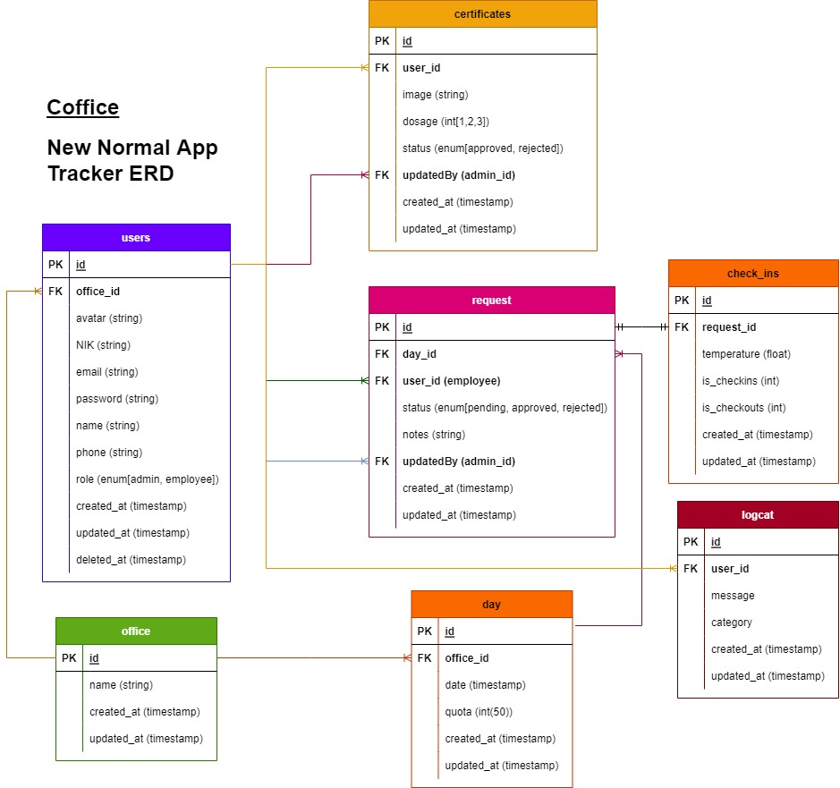
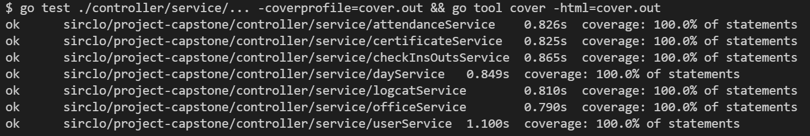

<!-- PROJECT LOGO -->
<br/>
<div align="center">
  <a href="">
    
  </a>
  <p align="center">
    RESTful API with Gorilla Mux(router) & RS Cors(cors)
    </br>
    <a href="https://github.com/HamzahAA15/group2-project-capstone/issues">Report Bug</a>
    .
    <a href="https://github.com/HamzahAA15/group2-project-capstone/issues">Request Feature</a>

  </p>
</div>

### 🛠 &nbsp;Build App & Database

&nbsp;
&nbsp;
&nbsp;
&nbsp;
&nbsp;
&nbsp;
&nbsp;
&nbsp;
&nbsp;
&nbsp;
&nbsp;
&nbsp;

<!-- ABOUT THE PROJECT -->

## 💻 &nbsp;About The Project

<p>
  Cofficed is an app for tracking employee who want to Work From Office(WFO). First employee should upload their vaccine certificate, then create a request for WFO at certain office & date, after that admin will review and decide their request whether it would be approved or rejected.
</p>

<p>
Cofficed was created for the purpose to prevent and reduce the spread of novel coronavirus covid-19. Built using only the GO standard library, utilize Gorilla Mux at router and RS CORS, with layered architecture approach and isolate the service as a place only for business logic. 
</p>

[OPEN API](https://app.swaggerhub.com/apis-docs/justjundana/Cofficed/1.2#/)

Find our awesome Front-End repository By Felicia & Lukman below
</br>
[Click Here!](https://github.com/feliciakri/cofficed)

<details>
<summary>ERD</summary>

</details>
<details>
<summary>🧑‍💼🙎 &nbsp;Users</summary>
  
| Feature User | Endpoint | Query Param | Request Body | JWT Token | Fungsi |
| ------------ | ---------| ----------- | ------------ | --------- | ------ |
| POST         | /users/login | - | identity & password | NO | login user with identity & passwords |
| POST         | /users/register  | - | - | YES |  |
| POST         | /users/avatar  | - | avatar | YES | upload avatar for user profile |
| GET          | /users/profile | - | - | YES | get current user profile |
| PUT          | /users/ | - | password | YES | update current user profile |

</details>

<details>
<summary>🏤📦 &nbsp;Office</summary>
  
| Feature Office | Endpoint | Query Param | Request Body | JWT Token | Fungsi |
| --- | --- | --- | --- | --- | --- |
| GET | /offices/ | - | - | YES | get all offices data |

</details>

<details>
<summary>📓 &nbsp;Request</summary>

| Feature Request | Endpoint          | Query Param                                                                                                          | Request Body                         | JWT Token | Fungsi                                                         |
| --------------- | ----------------- | -------------------------------------------------------------------------------------------------------------------- | ------------------------------------ | --------- | -------------------------------------------------------------- |
| GET             | /attendances/     | employee_email(str), date_start(str(yyyy-mm-dd)), date_end(str(yyyy-mm-dd)), status(str), office_id(str), order(str) |                                      | YES       | get wfo request data based on desired query param              |
| GET             | /attendances/user | status(str), order(str)                                                                                              |                                      | YES       | get current user wfo request data based on desired query param |
| POST            | /attendances/     | -                                                                                                                    | day_id(str)                          | YES       | create wfo request data(employee)                              |
| PUT             | /attendances/     | -                                                                                                                    | day_id(str), status(str), notes(str) | YES       | update wfo request data status and notes (admin only)          |

</details>

<details>
<summary>🗓&nbsp;Day</summary>

| Feature Day | Endpoint | Query Param      | Request Body            | JWT Token       | Fungsi            |
| ----------- | -------- | ---------------- | ----------------------- | --------------- | ----------------- |
| GET         | -        | office_id & date | -                       | YES             | get all days data |
| PUT         | -        | -                | day_id(str), quota(int) | YES(only admin) | update day data   |

</details>

<details>
<summary>💉&nbsp;Vaccine Certificates</summary>

| Feature Certificates | Endpoint           | Query Param | Request Body | JWT Token       | Fungsi                                     |
| -------------------- | ------------------ | ----------- | ------------ | --------------- | ------------------------------------------ |
| GET                  | /certificates/     | -           | -            | YES(only admin) | get all employee's certificate             |
| GET                  | /certificates/user | -           | -            | YES             | get current user certificate               |
| POST                 | /certificates/     | -           | image        | YES             | upload certificate                         |
| PUT                  | /certificates/     | -           | id & status  | YES(only admin) | admin update employee's certificate status |

</details>

<details>
<summary>⏱️&nbsp;Checkins</summary>

| Feature Checkins | Endpoint    | Query Param | Request Body               | JWT Token | Fungsi                   |
| ---------------- | ----------- | ----------- | -------------------------- | --------- | ------------------------ |
| GET              | /check/     | -           | -                          | YES       | get all checkin data     |
| GET              | /check/user | -           | -                          | YES       | get checkin current user |
| POST             | /check/ins  | -           | attendance_id & temprature | YES       | -                        |
| POST             | /check/outs | -           | id & attendance_id         | YES       | -                        |

</details>

<details>
<summary>📖&nbsp;Logcat</summary>

| Feature Checkins | Endpoint      | Query Param | Request Body | JWT Token | Fungsi                          |
| ---------------- | ------------- | ----------- | ------------ | --------- | ------------------------------- |
| GET              | /logcats/     | -           | -            | YES       | get all system log data         |
| GET              | /logcats/user | -           | -            | YES       | get system log for current user |

</details>

<details>
<summary>Testing</summary>

</details>

<p align="right">(<a href="#top">back to top</a>)</p>

<!-- CONTACT -->

# How to Use

### 1. install

```bash
git clone https://github.com/HamzahAA15/group2-project-capstone
```

### 2.1 create file .env

```bash
touch .env
```

### 2.2 open .env

```
nano .env
```

### 2.3 write .env

```bash
mysqlUser=<user>/root
mysqlPassword=<password>
mysqlHost=localhost
mysqlPort=3306
mysqlName=<schema name>
mysqlParsetime=True
mysqlTimeLocation=Local
REGION=<region AWS>/ap-southeast-1
KEYID=<KEYID AWS S3>
SECRETKEY=<SECRETKEY AWS S3>
```

### 3. run main.go

```bash
go run main.go
```

# Contact

[](https://www.linkedin.com/in/jundanaalbasyir/)
[](https://www.linkedin.com/in/hamzahaalfauzi/)
[](https://github.com/justjundana)
[](https://github.com/HamzahAA15)

<p align="center">:copyright JH Top Golang Dev</p>
</h3>

<p align="right">(<a href="#top">back to top</a>)</p>
